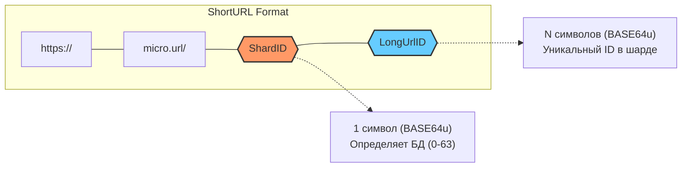
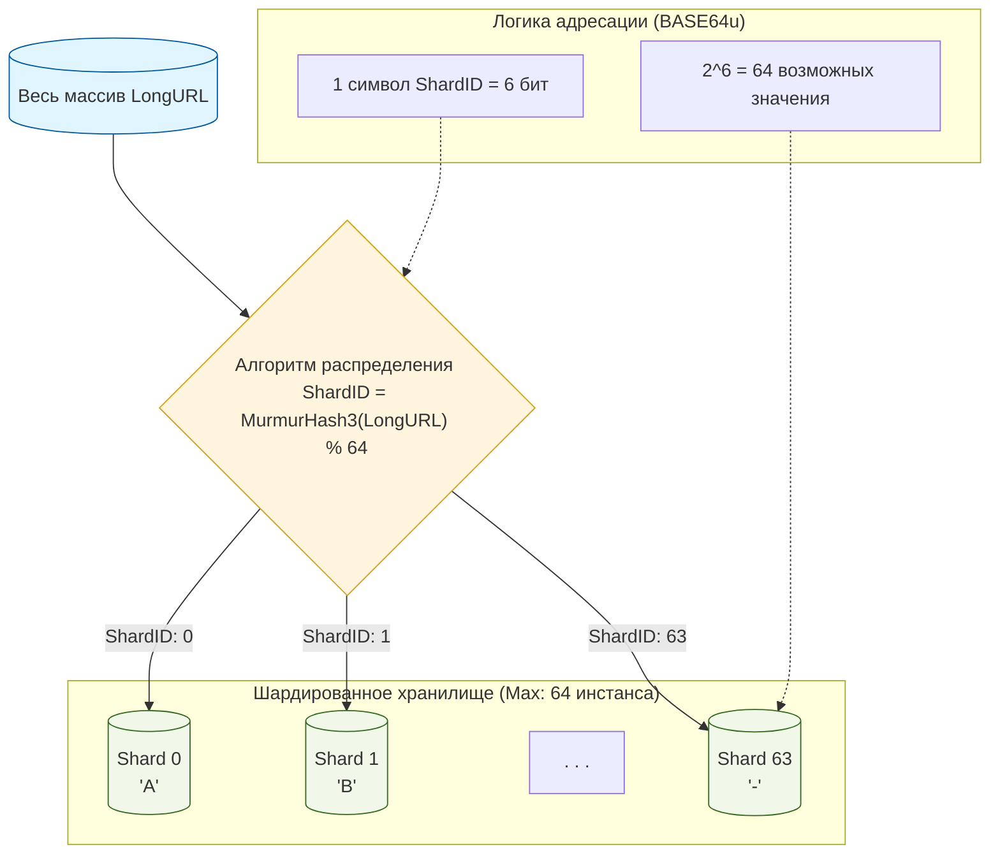
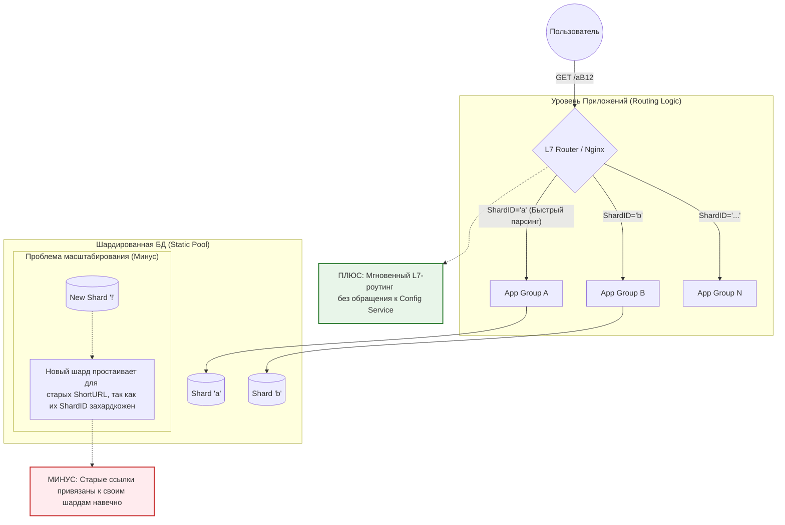
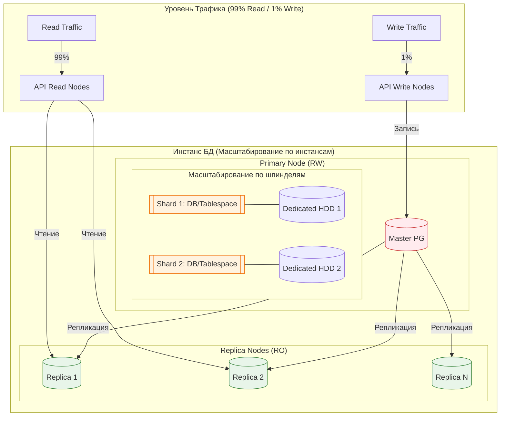
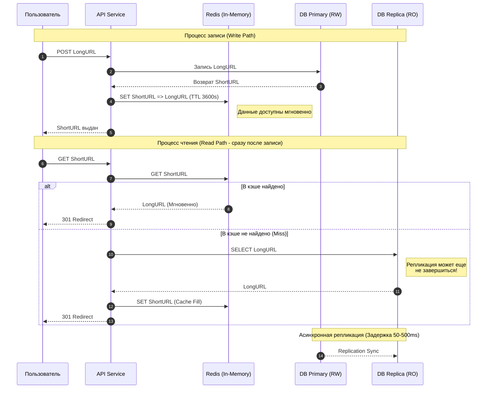
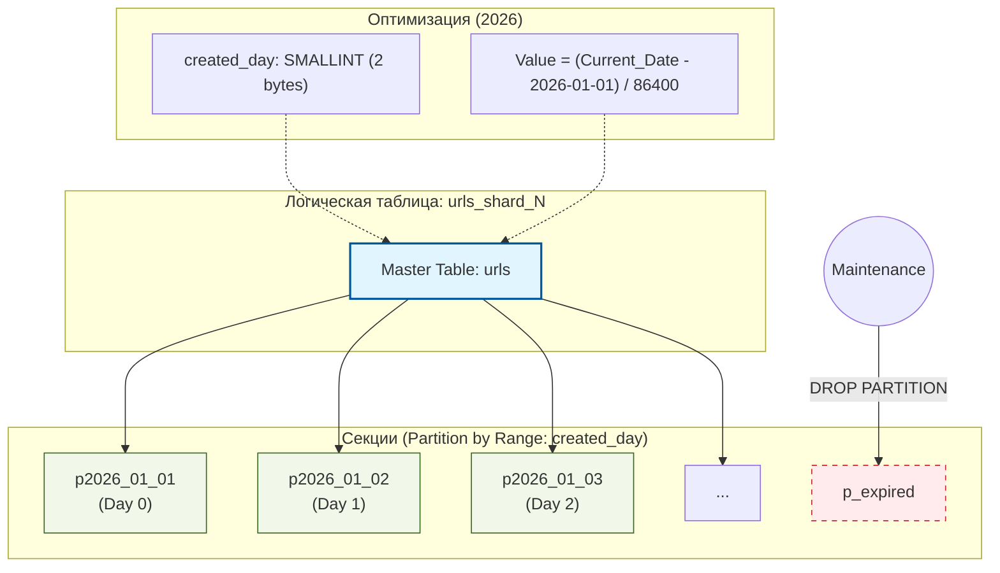
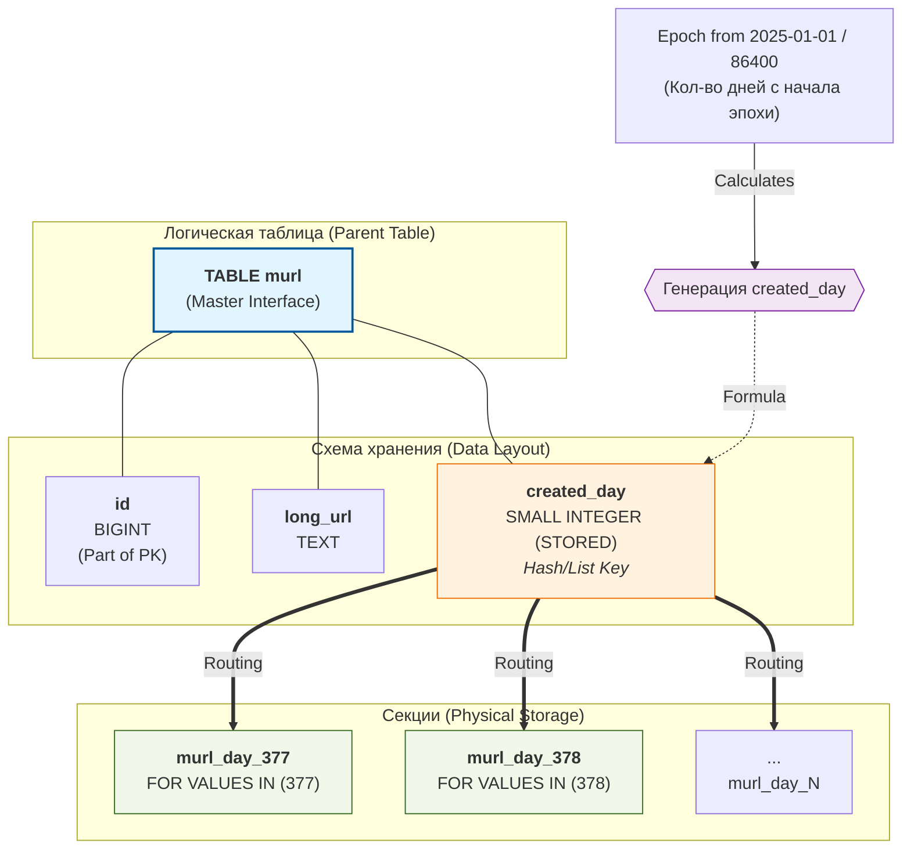

# MicroURL


HighLoad сервис сокращателя ссылок.  
Преобразует длинные URL (**LongURL**) в короткие (**ShortURL**) и обратно.

Так как сервис проектируется под огромные нагрузки, то HighLoad архитектура сервиса влияет на формат **ShortURL**.

## Формат ShortURL

    [proto]://[domain]/[ShardID][LongUrlID]

**\[ShardID]** (1 символ) - Идентификатор шарда, на котором хранится LongURL в формате BASE64u  
**\[LongUrlID]** (остальные символы) - Идентификатор LongURL записи в шарде в формате BASE64u

**\[ShardID]** и **\[LongUrlID]** кодируются в **BASE64u** потому, что символы этого формата не подлежат URL эскейпингу.



## Шардирование

Для распределения нагрузки по нескольким серверам используется горизонтальное масштабирование,
которое подразумевает разбиение всего массива данных на несколько отдельных независимых частей, в
общем случае хранящихся в отдельных инстансах БД.

Так как для номера шарда **ShardID** выделен 1 символ из набора BASE64u, то максимальный объем шардированного хранилища ограничен 64 шардами.



### Формула вычисления номера шарда

    ShardID = MurmurHash3(LongURL) % 64

Функция хэширования **MurmurHash3** выбрана потому, что она быстро вычисляется и обеспечивает разницу менее 1% в объеме данных между
самым «тяжелым» и «легким» шардами, что исключает появление «горячих» шардов.

## Роутинг по шардам

Явное указание номера шарда в ShortURL имеет:  
+ **Плюс**: Можно маршрутизировать запрос в шард не только на уровне **Приложение->БД**, но и на уровне **L7 Роутер->Приложение** с наименьшими затратами вычислительных ресурсов.
+ **Минус**: Номер шарда захардкожен, поэтому добавление новых шардов к имеющемуся пулу не снизит в короткой перспективе нагрузку на уже имеющиеся шарды.



## Горизонтальное масштабирование по инстансам

Для нивелирования указанного минуса нужно завести пул из максимально возможного количества шардов и распределить его на имеющиеся инстансы, в общем случае не равномерно с учетом вычислительной мощности каждого инстанса.

Когда инстансы перестанут справляться с нагрузкой, можно будет добавить еще несколько инстансов и перераспределить имеющиеся 64 БД на уже увеличенное количество инстансов.

## Горизонтальное масштабирование по шпинделям

В базах данных помимо вычислительных ресурсов CPU активно утилизируется пропускная способность HDD. Наличие нескольких шардов на одном инстансе БД PostgreSQL (каждый в отдельной DATABASE/TABLESPACE) позволяет сделать оптимизацию, когда каждый шард находится на выделенном HDD. При таком решении пропускные способности "шпинделей" инстанса складываются. Такое решение было довольно эффективно в эру HDD.

## Горизонтальное масштабирование CQRS

**CQRS (Comand Query Resposibility Segregation)** - разделение операций чтения и записи данных в приложении.
Сервис **MircoURL** неравномерно нагружен по операциям записи и чтения: 1% нагрузки - это запись **LongURL** в БД и 99% нагрузки - это чтение **LongURL** по **ShortURL** идентификатору.

Для таких **read-heavy** систем БД применяется паттерн проектирования **CQRS**, суть которого заключается в назначении одного из инстансов БД RW мастером с возможностью записи новых данных в его шарды и копировании данных с помощью репликации с ведущего RW истанса в несколько ведомых RO истансов. А приложение, работающее с хранилищем, из конфигурации определяет в какой инстанс БД можно **INSERT**ить новые данные, а из какого инстанса **SELECT**ить.

## Ограничения PostgreSQL

В БД PostgreSQL есть известная проблема: соединение с БД очень дорогое. Поэтому количество одновременно работающих соединений в PostgreSQL ограничено сотнями соединений.

Для нивелирования этой проблемы используют Proxy серверы, например: PgPool II. Такие решения решают проблему множественных соединений к БД, но при этом вносят свои существенные особенности в работу с БД.

Но мы пойдем другим путем: каждое приложение будет иметь одно соединение к шарду в инстансе. Количество соединений к PostgreSQL инстансу от запущенных приложений регулируется количеством шардов, расположенных на инстансе. Т.е., если мы приблизились к пределу количества коннектов к инстансу PostgreSQL, нужно добавить инстансов и перераспределить шарды на новые инстансы. Количество соединений на каждом инстансе уменьшится. Это решение неприемлемо для энтерпрайзных решений, но для микросерверной архитектуры, когда для каждого микросервиса выделяется своя БД, решение приемлемо.


## Резервное копирование и восстановление после сбоев

Репликация помимо распределения RW и RO нагрузки на разные инстансы дает возможность резервного копирования данных без влияния на функциональность всего сервиса и возможность быстрого переключения со сломанного RW инстанса на исправный RO инстанс с одновременным переводом его в роль RW инстанса. Если добавить в систему оркестратор кластера типа **Patroni**, то такое переключение будет осуществляться автоматичеки. Но кластерное решение по отказоустойчивости выходит за рамки моего учебного проекта.



## Кэширование

Так как наиболее производительной репликацией является асинхронная репликация, то сервис будет страдать рассинхронизацией данных, когда данные записываются на RW сервер, но не успевают скопироваться на RO сервера (Stanby) до момента чтения данных с RO серверов.

Нивелировать этот эффект может применение очень быстрых InMemory кэшей данных, например Redis.

**Запись длинного URL в БД:**
+ App записывает LongURL в RW БД и получает ShortURL
+ App записывает связь ShortURL => LongURL в Redis с приемлемым TTL (3600 сек, например)
+ App публикует ShortURL пользователю

**Чтение длинного URL из БД:**
+ App запрашивает ShortURL в Redis
+ App, если ShortURL не нашелся в Redis, запрашивает ShortURL в RO БД.
+ Опционально: App записывает связь ShortURL => LongURL в Redis с приемлемым TTL (3600 сек, например)

В результате пользователь будет получать свою длинную ссылку из Redis пока данные реплицируются между RW и RO базами данных.

Конечно, бывают случаи, когда репликация задерживается на очень продолжительный срок, но будем относить такие случаи к аварийным событиям.  
Очень хочется при отсутствии записи в БД сходить в RW или другую RO БД, но этого делать нельзя, так как это путь к лавинообразному возрастанию паразитной нагрузки. Лучше пользователю честно сообщить о том, что URL не найден.



## Достоверность ShortURL

Некоторые пользователи будут просить MicroURL выдать LongURL для несуществующих ShortURL. Для противодействия таким действиям ShortURL должен содержать контрольные суммы, верифицирующие с некоторой долей вероятности достоверность данных, зашитых в ShortURL.

## Секционирование

Так как сервис планируется высоконагруженным, то и данных пользователей в нем будет довольно много.
Чтобы снизить нагрузку на БД во время удаления устаревших данных (**DROP PARTITION**), меньше страдать от **AUTOVACUUM** и модификации схемы хранения данных (**ALTER TABLE**), применяют вертикальное секционирование таблиц.

В моем учебном проекте я применяю Range - секционирование таблиц по времени создания записи.
Чтобы уменьшить индекс, время буду гранулировать по номеру дня (номер диапазона времени в 86400 сек) с 1 января 2026 года.
Для хранения времени использую самый маленький тип данных PostgreSQL **SMALLINT** (2 байта).
Побочный эффект: TTL длинных URL будет кратно 1 дню.




## Схема базы данных

В каждом из 64 шардов создается таблица, секционированная по времени.
Логическая структура (DDL для одного шарда):

```SQL
    CREATE TABLE murl (
        id         BIGINT NOT NULL,
        long_url   TEXT NOT NULL,
        created_day SMALL INTEGER GENERATED ALWAYS AS (
            FLOOR(EXTRACT(EPOCH FROM (created_day - '2025-01-01 00:00:00+00')) / 86400)
        ) STORED,
        CONSTRAINT pk_murl PRIMARY KEY (id, created_day)
    )
    PARTITION BY LIST (created_day);

    CREATE TABLE murl_day_377 PARTITION OF murl
        FOR VALUES IN (377);

    CREATE TABLE murl_day_378 PARTITION OF murl
        FOR VALUES IN (378);
    ...
```



## Обслуживание секционированной таблицы

**Секционированные таблицы требует обслуживания: нужно вовремя создавать партиции на следующие N дней.**  
На шарде обслуживать секционированные таблицы силами DBA довольно затруднительно, поэтому следует
применить расширение **pg_cron**, которое будет создавать новые партиции.  

```SQL
    SELECT cron.schedule('create-next-partitions-murl', '0 23 * * *', $$
    DO $do$
    DECLARE
        -- Укажите здесь количество дней, на которое нужно создать секции вперед
        days_ahead int := 3; 
        
        current_day_id int;
        target_day_id int;
        target_table_name text;
    BEGIN
        -- Вычисляем ID текущего дня (относительно 2025-01-01)
        current_day_id := FLOOR(EXTRACT(EPOCH FROM (NOW() - '2025-01-01'::timestamp)) / 86400);

        FOR i IN 1..days_ahead LOOP
        target_day_id := current_day_id + i;
        target_table_name := 'murl_day_' || target_day_id;

        IF NOT EXISTS (SELECT FROM pg_tables WHERE tablename = target_table_name) THEN
            EXECUTE format('CREATE TABLE %I PARTITION OF murl FOR VALUES IN (%L)', 
                        target_table_name, target_day_id);
        END IF;
        END LOOP;
    END $do$;
    $$);
```  

Но в моем учебном проекте **pg_cron** будет и удалять старые, так как я ленивый и в данном случае безответственный (у учебного проекта нет ответственности)...  

```SQL
    -- Задание: раз в месяц удалять секции старше 90 дней
    SELECT cron.schedule('purge-old-partitions-murl', '0 0 1 * *', $$
    DO $purge$
    DECLARE
        row record;
        -- Определяем порог удаления: сегодняшний номер дня минус 90
        retention_threshold int := FLOOR(EXTRACT(EPOCH FROM (NOW() - '2025-01-01')) / 86400) - 90;
        partition_value int;
    BEGIN
        -- Цикл по всем секциям родительской таблицы 'murl'
        FOR row IN
            SELECT
                nmsp_parent.nspname AS parent_schema,
                parent.relname      AS parent_name,
                nmsp_child.nspname  AS child_schema,
                child.relname       AS child_name
            FROM pg_inherits
                JOIN pg_class parent            ON pg_inherits.inhparent = parent.oid
                JOIN pg_class child             ON pg_inherits.inhrelid  = child.oid
                JOIN pg_namespace nmsp_parent   ON parent.relnamespace   = nmsp_parent.oid
                JOIN pg_namespace nmsp_child    ON child.relnamespace    = nmsp_child.oid
            WHERE parent.relname = 'murl'
        LOOP
            -- Извлекаем числовой ID дня из имени таблицы (например, из 'murl_377' получим 377)
            -- Используем регулярное выражение для поиска цифр в конце имени
            partition_value := (regexp_matches(row.child_name, '(\d+)$'))[1]::int;

            -- Если номер дня в названии секции меньше порога — удаляем
            IF partition_value < retention_threshold THEN
                RAISE NOTICE 'Удаление старой секции: %', row.child_name;
                EXECUTE format('DROP TABLE %I.%I', row.child_schema, row.child_name);
            END IF;
        END LOOP;
    END $purge$;
    $$);
```

## Инфраструктура

Разработчик может легко развернуть описанный кластер MicroURL сервиса по [инструкции](infra/pg18/README.md)
