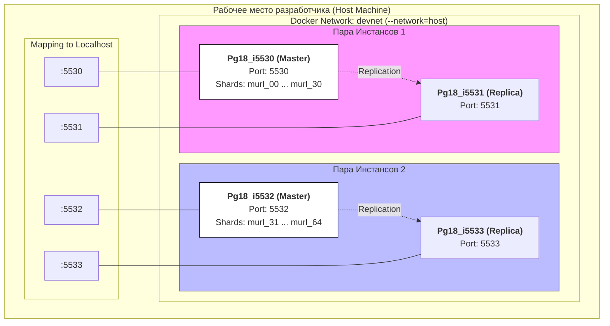

# PostgreSQL 18

Инструкции, сборки **docker** образов PostgreSQL 18.1 и запуска необходимого количества инстансов на локальном компьютере разработчика.  
Инструкции приведены в виде GNUmakefile файла

## Архитектура сборки

На рабочем месте разработчика поднимается 4 контейнера **Pg18_i5530**, **Pg18_i5531**, **Pg18_i5532**, **Pg18_i5533**.  
**Pg18_i5530** - Мастер инстанс с шардами murl_00 .. murl_30  
**Pg18_i5531** - Инстанс-реплика Pg18_i5530  
**Pg18_i5532** - Мастер инстанс с шардами murl_31 .. murl_64  
**Pg18_i5533** - Инстанс-реплика Pg18_i5532  

Каждый инстанс PostgreSQL слушает свой порт 5530, 5531, 5532, 5533 соответственно. Это сделано для того, чтобы можно было эти контейнеры поднять на **--network=host** без конфликтов по портам, к тому же выделение персонального порта для каждого инстанса позволяет легко реализовать маршрутизацию на уровне L3 прокси сервера.

Данное множество контейнеров поднимаются в **--network=devnet** с прокидыванием портов контейнера на **localhost**

## Зависимости
На локальном Linux (Ubuntu) компьютере должны быть установлены:
+ make
+ psql
+ docker
+ jq

## make setup
Комплексная команда, запускающая:
+ Генерацию docker образов PostgreSQL и хранилища резервной копии БД
+ Настройку виртуальной сети разработчика **devnet**
+ Настройку volumes для данных БД

## make info
Выводит информацию:
+ Сгенерированные для PostgreSQL docker образы
+ Установленные сети (devnet)
+ Созданные volumes
+ Запущенные инстансы PostgreSQL

## make images
Пересобирает образы PostgreSQL (**pg18**) и пустого хранилища БД (**pg18_data**)

## make network
Удаляет, а потом заново создает сеть **devnet**

## make volumes
Удаляет, а потом заново создает volumes **pg18_i***

## make up
Запускает инстансы PostgreSQL

## make stop
Остановить инстансы PostgreSQL, но не удалять контейнеры

## make down
Остановить инстансы и удалить контейнеры PostgreSQL

## make commit
Закоммитить в репозиторий содержимое volumes в образ **pg18_data_i*:latest**. Старый образ затежить backup тэгом.

Команда полезна не только для резервного копирования данных из образов, но и для экспорта данных в какой-нибудь CI/CD

## make checkout
Импортировать данные из образов **pg18_data_i*:latest** в volumes.

## make pg18_i*
Подключиться к нужному инстансу

## Почему не использован docker compose
Потому, что в этой папке изучаем ванильный **docker**. docker compose делает то же самое на основании конфигурационного файла.
