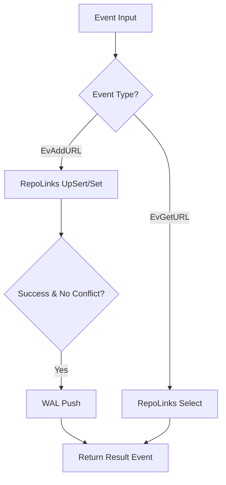

# Repository Orchestrator (repo_impl.go)

Данный модуль реализует интерфейс `repository.Repo` и является центральным узлом управления данными в проекте **Murl**. Он объединяет в себе оперативную память (In-Memory), персистентное хранилище (PostgreSQL) и журнал транзакций (WAL).

## Функциональные возможности

Модуль `repo` инкапсулирует сложную логику взаимодействия различных подсистем:

1.  **Полиморфизм драйверов**: Поддержка переключения между `InMemory` и `PgDB` на лету через конфигурацию без изменения вызывающего кода.
2.  **Гарантия сохранности (WAL)**: 
    *   **Запись**: Каждое изменяющее событие (`EvAddURL`, `EvBatch`) сначала фиксируется в WAL перед подтверждением.
    *   **Восстановление**: При инициализации (`NewRepo`) модуль автоматически вычитывает WAL и "проигрывает" события для восстановления состояния.
3.  **Единая точка входа (`On`)**: Обработка всех операций через типизированные события `event.Event`, что упрощает отладку и трассировку.
4.  **Умный UpSert**: 
    *   Автоматическое обогащение событий данными (генерация `ShortURL`).
    *   Обработка конфликтов (дубликатов) без засорения WAL лишними записями.

## Архитектура потока данных

При вызове метода `On(ctx, event)`:



## Пример использования

```go
// 1. Настройка конфигурации
cfg := &MyConfig{
    driver: "PgDB",
    shardSize: 64,
    dsn: "postgres://...",
    walPath: "/var/lib/murl/events.wal",
}

// 2. Инициализация (включает авто-восстановление из WAL)
r, err := repo.NewRepo(ctx, cfg)
if err != nil {
    log.Fatal(err)
}

// 3. Отправка события
input, _ := event.MakeEvent(event.PayloadAddURL{OriginalURL: "https://go.dev"}, nil)
result, err := r.On(ctx, input)
```

## Внутренние компоненты

*   **`pgCluster`**: Управление пулом шардов PostgreSQL.
*   **`memCore`**: Ядро для работы в режиме InMemory.
*   **`repoLinks`**: CRUD-интерфейс, специфичный для выбранного драйвера.
*   **`wal`**: Интерфейс записи журнала событий.

## Особенности реализации

*   **Thread Safety**: Модуль полностью потокобезопасен благодаря шардированию внутренних хранилищ.
*   **Context Support**: Все операции поддерживают проброс `context.Context` для корректной отмены запросов и таймаутов.
*   **Error Handling**: При сбое записи в WAL операция считается неуспешной, чтобы предотвратить расхождение данных между памятью и диском.
